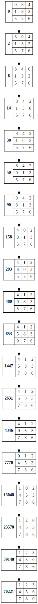
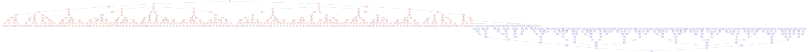
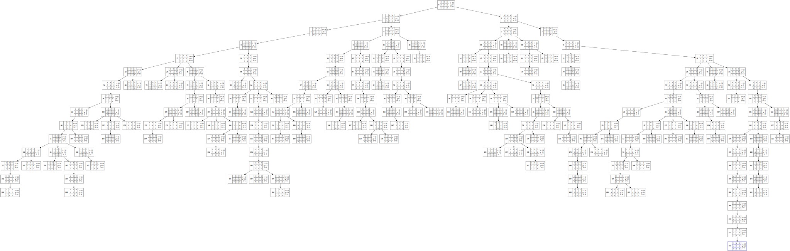

# 【第1問】8パズル
## 問題設定
### 初期状態
||||
|---|---|---|
||8|4|
|1|3|2|
|5|7|6|
### 目標状態
||||
|---|---|---|
|1|2|3|
|4|5|6|
|7|8||

## 手法
- 幅優先探索
- 双方向探索
- 欲張り探索（）
- A\*探索
    - 
    - 

ヒューリスティック関数を
- : ゴール位置にないタイルの数
- : ゴール状態からのタイルのマンハッタン距離の和

とする．

## 結果
[Pythonによる実装の実行](./answer.ipynb)

### 幅優先探索

### 双方向探索

### 欲張り探索

### A\*探索
#### 

#### 

### 比較
それぞれの探索手法の結果をまとめると下表となる．

|手法|計算時間(ms)|展開回数|解の経路コスト|
|:---:|---:|---:|---:|
|幅優先探索|907.533|70221|18|
|双方向探索|18.295|469|18|
|欲張り探索()|113.441|4062|40|
|A\*探索()|70.949|1892|18|
|A\*探索()|6.999|212|18|

## 考察
探索コストを比較すると，  
A\*探索() < 双方向探索 < A\*探索() < 欲張り探索() < 幅優先探索  
となった．

経路コストの観点では，欲張り探索()のみ最適解を得られなかった．表には載せていないが，欲張り探索()では解を得られなかった（不完全）．

今回の問題では，双方向探索は知識（ヒューリスティクス）を用いていないにも関わらずA\*探索に匹敵する探索コストだということがわかった．また，A\*探索においてはヒューリスティック関数の設定によって探索コストが10倍程度異なるということもわかった．