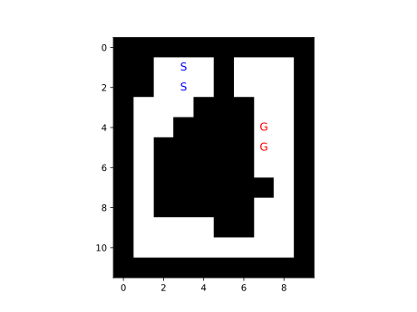
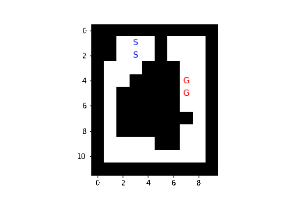
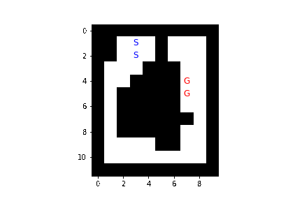
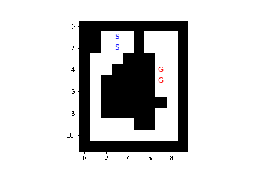

# 【第2問】ロボットの経路計画

## 問題設定

ロボットは上下左右に並進移動および90度回転移動できるものとする．

## 手法
- 幅優先探索
- A\*探索
- LRTA\*探索（3回繰り返す）

ヒューリスティック関数はロボット中心のマンハッタン距離とする．

## 結果
[Pythonによる実装の実行](./answer.ipynb)

### 幅優先探索

### A\*探索

### LRTA\*探索
#### 1回目

#### 2回目

#### 3回目

### 比較
それぞれの探索手法の結果をまとめると下表となる．

|手法|計算時間(ms)|展開回数|解の経路コスト|
|:---:|---:|---:|---:|
|幅優先探索|0.307|47|24|
|A\*探索|0.382|46|24|
|LRTA\*探索（1回目）|2.745|263|263|
|LRTA\*探索（2回目）|0.441|68|68|
|LRTA\*探索（3回目）|0.325|39|39|

## 考察
A\*探索では幅優先探索よりも1回だけ少ない展開回数で最短経路の最適解が得られた．しかし，計算時間は幅優先探索よりも長かった．これはヒューリスティック関数の計算や展開されたノードのソート等の処理で時間がかかったためだと考えられる．また，展開回数の差が1しかなく，計算時間の観点からも今回の問題では幅優先探索で十分に探索コストを抑えることができたと考えられる．

一方，LRTA\*探索では最適解が得られず，探索コストも以上2つの手法に比べて概ね大きかった．しかしながら，3回目のLRTA\*探索ではA\*探索よりも短い計算時間，少ない展開回数で解が得られた．これは学習が進んだ結果だと考えられる．とはいえ，今回の小規模な問題では実時間探索法の一種であるLRTA\*を用いずとも幅優先探索やA\*探索を用いて低い計算量で解を得ることができたと考えられる．